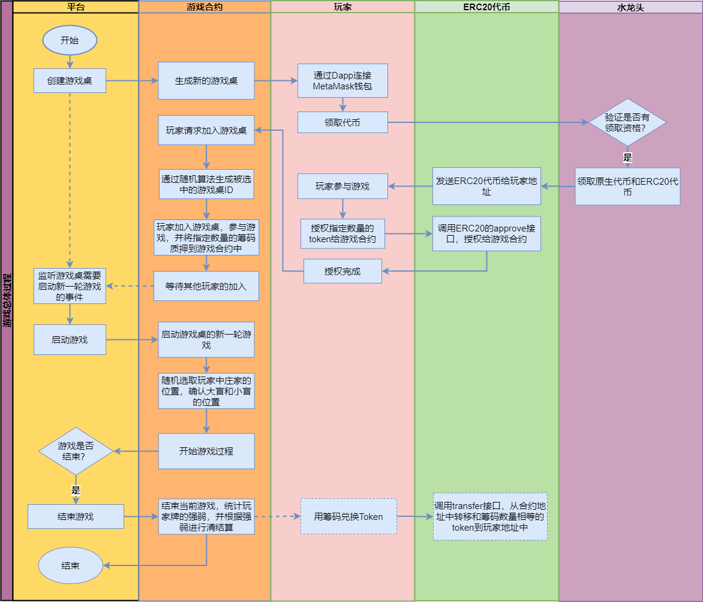

## 合约设计

### 概述

Game-Dapp支持使用20代币进行结算，所以Game-Dapp中主要涉及两个合约：

- 20代币合约：遵循ERC20代币标准，用于游戏结果的结算；
- TexasHoldEm合约 ：用于实现德州扑克游戏逻辑合约，与Dapp前端进行交互；


### 规则说明

- 德州扑克卡牌说明（从强到弱排列）：

  - 皇家同花顺：同一花色的**10, J, Q, K, A**；

  - 同花顺：同一花色的五张连续牌。
  - 四条：四张同样点数的牌。
  - 满堂红（葫芦）：三张同样点数的牌，加上一对其他点数的牌。
  - 同花：五张同一花色的牌。
  - 顺子：五张连续的牌。
  - 三条：三张同样点数的牌。
  - 两对：两个对子。
  - 一对：两张同样点数的牌。
  - 高牌：如果没有任何一种牌型，那么就以最高牌的大小来比较。

- 德州扑克游戏规则说明：

  - 每个玩家会被发两张手牌，然后在游戏的不同阶段中会有5张公共牌被逐一翻开；
  - 游戏过程中，玩家可以进行下注、跟注、加注、弃牌等操作。游戏分为四个阶段：翻牌前、翻牌、转牌和河牌。在每个阶段结束后，未弃牌的玩家将继续进行下一轮的操作，直到只剩下一个玩家或所有玩家都弃牌为止。

  - 最后，根据最强的牌型和筹码数量，来决定胜利者。如果有两个或多个玩家拥有相同的牌型，那么将比较他们手牌中的最高牌，如果最高牌相同，则比较次高牌，以此类推，直到找到最大的牌为止。如果最后仍然无法决定胜负，那么将把奖池平分给这些玩家。

### 功能说明

- 创建游戏桌

  - 设定玩家加入规则：最低/最高下注数，总共参与的人数限制；
  - 保存游戏桌中，正在进行的游戏信息：游戏桌id，游戏状态，玩家信息，公共牌（5张）等；
  - 玩家信息：地址，状态（是否开始），卡牌，下注数等；

- 查询游戏桌详情

  - 返回游戏桌信息

- 玩家加入游戏桌

  - 以游戏桌为单位，加入到指定的游戏桌中；
  - 首次加入，则设置为同意参与游戏；
  - 授权手中的筹码给游戏合约地址；

- 玩家兑换token

  - 指定游戏桌，兑换指定数量的筹码为token；

- 查询玩家信息

  - 指定游戏桌，返回当前玩家信息：地址，状态（是否开始），卡牌，下注数等；

- 玩家加入游戏

  - 玩家指定游戏桌发起参与游戏，然后等待当前游戏桌中的其他玩家参与游戏；
  - 游戏桌中的游戏状态为正在进行时，玩家则不能参与游戏；

- 开启新的一轮游戏

  - 开启指定游戏桌的新的一轮游戏；

  - 启动游戏后，确认庄家，大盲，小盲的位置，并且小盲和大盲要下注，把token转移到合约地址中；

  - 按照参与游戏的玩家顺序开始发牌；

- 玩家跟注

  - 玩家根据当前游戏桌上的注进行跟注；
  - 判断：是否轮到自己，并且是否有足够的筹码；

- 玩家加注

  - 玩家根据当前游戏桌上的注进行加注；
  - 判断：是否轮到自己，并且是否有足够的筹码；

- 玩家查牌

  - 玩家当前轮查牌；
  - 判断：是否轮到自己；

- 玩家弃牌

  - 玩家当前游戏弃牌；
  - 判断：是否轮到自己；

- 结束当前游戏（内部函数，根据游戏状态自动调用）

  - 当前游戏结束；
  - 根据游戏规则统计指定局游戏的玩家的卡牌大小（强弱）；
  - 根据牌的强弱进行清结算；
  - 重置游戏桌中信息：状态，卡牌，玩家状态信息等；


### 流程设计

- 总体流程图

  

- 创建游戏桌

- 玩家加入游戏

- 玩家兑换Token

- 开启新的一轮游戏

- 玩家跟注

- 玩家加注

- 玩家查牌

- 玩家弃牌

- 结束游戏

### 接口说明

#### 创建游戏桌

```js
function createTable(uint256 _smallBlind, uint256 _bigBlind, address _tokenAddr) public
```

> 参数说明：
>
> - _smallBlind：最小下注数；
> - _bigBlind：最大下注数；
> - _tokenAddr：结算的AARC20 Token地址；

#### 查询游戏桌详情

```js
function getTableInfo(uint256 tableId) public view 
    returns (
        uint256 state, // 游戏状态：PREFLOP，FLOP，TURN，RIVER，FINISH
        uint256 dealer, // 庄家
        uint256 smallBlind, // 小盲注
        uint256 bigBlind, // 大盲注
        uint256 bBPos, // 大盲注的位置，用于判断是否进行对公共牌进行操作：
        uint256 pot, // 奖池
        uint256 highestBet, // 当前轮最高下注数量
        uint256 turn, // 当前操作者的下标
        address tokenAddr, // token合约地址
        uint256[] memory board, // 公共牌
        address[] memory playerAddrList // 玩家的地址列表
    ) 
```

> 参数说明：
>
> - tableId：游戏桌Id

#### 查询游戏桌上的玩家信息

```js
function getPlayerInfo(uint256 tableId, address player) public view 
    returns (
        uint256 bet, // 玩家当前下注数
        uint256 handRank, // 玩家牌的强弱
        uint256[] memory bestHand, // 玩家牌和公共牌的最优组合
        uint256 balance, // 玩家的筹码余额
        bool active, 	// 玩家状态
        uint256[] memory hand // 玩家的牌
    )
```

> 参数说明：
>
> - tableId：游戏桌Id；
> - player：玩家地址

#### 玩家加入游戏

注意：玩家钱包地址发起交易；

```js
function joinGame(uint256 tableId, uint256 chips) public
```

> 参数说明：
>
> - tableId：游戏桌ID；
> - chips：玩家的筹码；

#### 玩家兑换Token

注意：玩家钱包地址发起兑换筹码成token的交易；

```js
function exchangeChipsForBalance(uint256 tableId, uint256 amount) public
```

> 参数说明：
>
> - tableId：游戏桌ID；

#### 开启新的一轮游戏

```js
function startRound(uint256 tableId) public isStop(tableId) public
```

> 参数说明：
>
> - tableId：游戏桌ID；

#### 玩家跟注

```js
function call(uint256 tableId, address player) public isTurn(tableId, player) inProcess(tableId) isActive(tableId, player)
```

> 参数说明：
>
> - tableId：游戏桌ID；
> - player：玩家的地址；

#### 玩家加注

```js
function raise(uint256 tableId, address player, uint256 amount) public isTurn(tableId, player) inProcess(tableId) isActive(tableId, player)
```

> 参数说明：
>
> - tableId：游戏桌ID；
> - player：玩家的地址；
> - amount：加注的注额；

#### 玩家查牌

```js
function check(uint256 tableId, address player) public isTurn(tableId, addr) inProcess(tableId) isActive(tableId, addr)
```

> 参数说明：
>
> - tableId：游戏桌ID；
> - player：玩家的地址；

#### 玩家弃牌

```js
function fold(uint256 tableId, address player) public isTurn(tableId, player) inProcess(tableId) isActive(tableId, player)
```

> 参数说明：
>
> - tableId：游戏桌ID；
> - player：玩家的地址；

#### 追加筹码

注意：玩家钱包地址追加筹码；

```js
function addChips(uint256 tableId, uint256 chips) public enoughAllowedTokens(tableId, 		msg.sender, amount)
```

> 参数说明：
>
> - tableId：游戏桌ID；
> - chips：追加的筹码数量；

#### 查看牌的花色和点数 

```js
function getNameByCardValue(uint256 card) view public returns (uint256 suit, uint256 rank, string memory cardName)
```

> 参数说明：
>
> - card：牌的数值；


#### 计算玩家的牌强弱排名 

```js
function calculateHandRank(uint256[] memory cards) pure public returns (uint256)
```

> 参数说明：
>
> - cards：玩家手中的牌和公共牌列表；
>
> 返回值说明：
>
> - 返回不同牌型代表的数值，如：
>   - 皇家同花顺：10；
>   - 同花顺：9；
>   - 四条：8
>   - 满堂红（葫芦）：7
>   - 同花：6
>   - 顺子：5
>   - 三条：4
>   - 两对：3
>   - 一对：2
>   - 高牌：1；


## 合约事件

```js
/// @notice 创建游戏桌事件
/// @dev 创建游戏桌事件
/// @param _tableId 游戏桌ID
/// @param _smallBlind 小盲注注额
/// @param _bigBlind 大盲注注额
/// @param _tokenAddr 清结算ERC20的合约地址
event CreateTable(uint256 _tableId, uint256 _smallBlind, uint256 _bigBlind, address _tokenAddr);

/// @notice 玩家参与游戏事件
/// @dev 玩家参与游戏事件
/// @param _tableId 游戏桌ID
/// @param _player 玩家地址
/// @param _amount 筹码
event JoinGame(uint256 _tableId, address _player, uint256 _amount);

/// @notice 新启动一局游戏的事件
/// @dev 新启动一局游戏的事件
/// @param _tableId 游戏桌ID
/// @param _playerAddrList 玩家地址列表
event StartRound(uint256 _tableId, address[] _playerAddrList);

/// @notice 玩家Check牌事件
/// @dev 玩家Check牌事件
/// @param _tableId 游戏桌ID
/// @param _player 玩家地址
event Check(uint256 _tableId, address _player);

/// @notice 玩家追注时触发事件
/// @dev 玩家追注时触发事件
/// @param _tableId 游戏桌ID
/// @param _player 玩家地址
/// @param _bet 追注数额
event Call(uint256 _tableId, address _player, uint256 _bet);

/// @notice 玩家加注时触发事件
/// @dev 玩家加注时触发事件
/// @param _tableId 游戏桌ID
/// @param _player 玩家地址
/// @param _raise 加注数额
/// @param _highestBet 当前最高下注额
event Raise(uint256 _tableId, address _player, uint256 _raise, uint256 _highestBet);

/// @notice 当玩家弃牌时触发
/// @dev 当玩家弃牌时触发
/// @param _tableId 游戏桌ID
/// @param _player 玩家地址
event Fold(uint256 _tableId, address _player);

/// @notice 结束游戏轮触发事件
/// @dev 调用endRound接口时触发
/// @param _tableId 游戏桌ID
/// @param _round 结束的当前轮：按照游戏状态分为：FLOP，TURN，RIVER，FINISH
/// @param _board 当前公共牌
event EndRound(uint256 _tableId, string _round, uint256[] _board);

/// @notice 游戏结束事件
/// @dev 重置游戏相关的参数
/// @param _tableId 游戏桌ID
event GameOver(uint256 _tableId);

/// @notice 创建事件：当确定获胜者触发
/// @dev 创建事件：当确定获胜者触发
/// @param _tableId 游戏桌ID
/// @param _numWinners 赢家地址列表
/// @param _winnerList 赢家地址列表
/// @param _revenuePerWinner 每个赢家的金额
event Winner(uint256 _tableId, uint256 _numWinners, address[] _winnerList, uint256 _revenuePerWinner);
```


# 合约测试

- 部署AARC20合约；

  - 玩家获取AARC20代币；

- 部署游戏合约

- 创建游戏桌：createTable

  - 指定小盲注和大盲注；
  - 指定用于结算的AARC20合约地址；

  以第一桌为例（tableId：0），进行如下操作。

- 查看游戏桌详情：getTableInfo；

- 玩家参与游戏：joinGame

  - 玩家参与游戏前，需要调用AARC20的approve接口，授权给游戏合约一定数量的token作为筹码；

  - 相关地址：

    ```
    【系统管理员地址】
    0x5B38Da6a701c568545dCfcB03FcB875f56beddC4
    
    【玩家地址】
    0xAb8483F64d9C6d1EcF9b849Ae677dD3315835cb2
    
    0x4B20993Bc481177ec7E8f571ceCaE8A9e22C02db
    
    0x78731D3Ca6b7E34aC0F824c42a7cC18A495cabaB
    
    0x617F2E2fD72FD9D5503197092aC168c91465E7f2
    ```

  - 查看玩家信息：getPlayerInfo

- 开启新的一轮游戏：startRound

  ```
  # 每个玩家获得两张个人牌
  
  庄家：0xAb8483F64d9C6d1EcF9b849Ae677dD3315835cb2  --> [5,40] --> [♣7, ♠3] --> 一对
  
  小盲注：0x4B20993Bc481177ec7E8f571ceCaE8A9e22C02db --> [11,38] --> [♣K, ♥A] --> 一对
  
  大盲注：0x78731D3Ca6b7E34aC0F824c42a7cC18A495cabaB --> [31,44] --> [♥7, ♠7] --> 一对
  
  玩家4：0x617F2E2fD72FD9D5503197092aC168c91465E7f2 --> [51,48] --> [♠A, ♠J] --> 高牌
  ```

- 追注

  - 玩家4/庄家/小盲注，分别进行追注call，或者弃牌fold；
  - 查看资金池：pot；

- 大盲注check翻转公共牌

  查看游戏桌中的公共牌：getTableInfo --> board;

  ```
  [36,29,43] --> [♥Q, ♥5, ♠6] 
  ```

- 加注

  - 玩家4进行加注（raise）；
  - 庄家/小盲注/大盲注，分别进行追注call，或者进行加注，或者弃牌fold；

- 翻牌

  如果没有人再进行加注，则开始进行check翻牌；查看公共牌：

  ```
  [36,29,43,27] --> [♥Q, ♥5, ♠6, ♥3] 
  ```

- 下一轮

  ```
  [36,29,43,27,50] --> [♥Q, ♥5, ♠6, ♥3, ♠K] 
  ```
